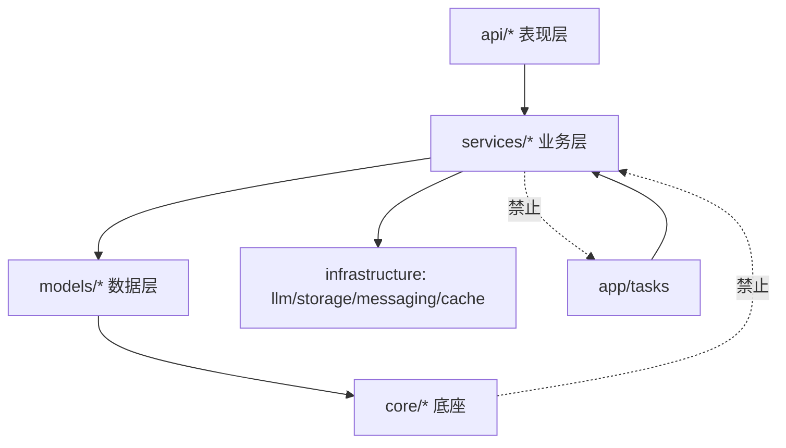
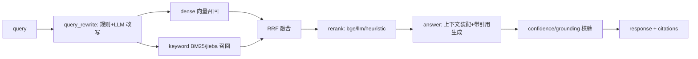
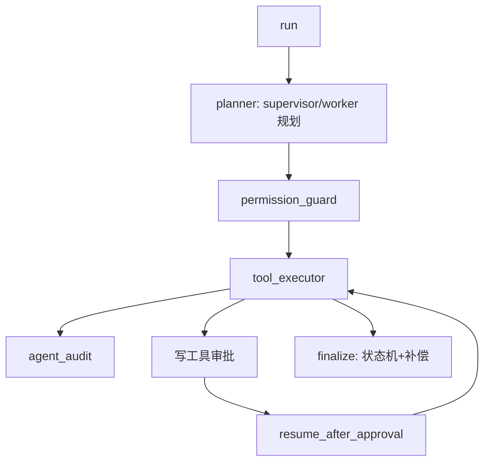

# 律智检 · 架构基线（ARCHITECTURE.md）

> 本文件是重构的「对照图」与依赖红线。完整评估与分阶段计划见
> [`docs/ARCHITECTURE_REFACTOR_PLAN.md`](./ARCHITECTURE_REFACTOR_PLAN.md)。

## 1. 架构风格

**模块化单体（Modular Monolith）+ 有界上下文**。单一 FastAPI 进程，按业务域纵向切片，
域内 `api / service / model` 内聚，域间只通过 service 门面通信。不引入微服务，不做完整 DDD 重写。

## 2. 目标目录结构

```
app/
├── api/            # 表现层：HTTP/WS 路由（已按域分组，P2b 完成，11 个域包）
│   ├── admin/  agent/  auth/  billing/  channels/  conversation/
│   ├── developer/  documents/  legal/  org/  tasks/
├── services/       # 业务层：已按有界上下文分包（P2 完成，14 个域包）
│   ├── auth/  org/  legal/  documents/  billing/  agent/  rag/  llm/
│   ├── notification/  observability/  integration/  storage/  jobs/  memory/
├── models/         # 数据层：ORM，按域分包子包
├── repositories/   # 数据访问 seam（渐进引入）
├── schemas/        # Pydantic DTO
├── core/           # 横切基础设施：config/ db/ llm/ security/ observability/ time/ errors/
├── mcp/            # MCP 工具执行
├── tools/          # Agent 工具
└── tasks/          # Celery（异步层，只依赖 services，禁止反向）
```

## 3. 依赖红线（禁止项）

```
api ──► service ──► model/repository ──► core
        ▲  ▲
        │  └──► infrastructure adapter（llm/storage/messaging/cache）
        └────── 域间只走 service 门面，禁止 import 他域内部实现
```

- ❌ `core` 反向 import `services`（环 C2 来源）。
- ❌ `models` import `services`。
- ❌ `services` import `app.tasks` / `core.celery_app`（环 C1 来源）。
- ❌ `api` 写业务逻辑（当前部分 API 过厚，逐步下沉 service）。
- ✅ `tasks` 依赖 `services`（单向）。

## 4. 有界上下文清单

认证账号 / 组织权限 / 对话记忆 / 文档 / 法律工作台 / RAG 检索 / Agent /
LLM 基础设施 / 计费订阅 / 通知外联 / 集成连接器 / 可观测审计 / 异步任务 / MCP。

## 5. 关键架构决策（ADR 摘要）

| # | 决策 | 理由 |
|---|---|---|
| ADR-1 | 模块化单体，非微服务 | 团队规模与部署复杂度不支撑微服务；单体 + 强边界即可满足高内聚低耦合 |
| ADR-2 | 服务层按有界上下文分包 | 消除 95 文件平铺，恢复内聚 |
| ADR-3 | RAG 统一门面（`rag_service` 单例） | 收敛约 10 个碎片文件的检索能力；对外只暴露一个 `RAGService` 门面 |
| ADR-4 | LLM「治理」单一归属 | 消除 core 与 services 双实现 |
| ADR-5 | 异步层单向依赖业务层 | 打破 5 节点循环依赖 |
| ADR-6 | 契约门测试保护 OpenAPI | 重构阶段防接口回归 |

> 逐条决策的完整背景见 [`docs/adr/`](./adr/)。

## 6. 数据流

```
HTTP/WS → api → service → model → core(db/auth/config) + 外部(LLM/向量库/Redis/MySQL/飞书)
Agent：agent_service → planner → workflow_nodes → tools → mcp → llm_client
RAG：  document_service → parsing/indexing → vector_store → rag → llm_service
异步： api 创建任务 → Celery(app/tasks) → services → task_status/WS
```

## 7. 重构进度（对照图）

| 阶段 | 内容 | 状态 |
|---|---|---|
| P0 | 工程卫生 + ruff/prettier/pre-commit 工具链 | ✅ |
| P1 | 打破 4 处循环依赖（C1~C4） | ✅ |
| P2 | `services/` 95 文件 → 14 个域子包 | ✅ |
| P2b | `api/` 33 文件 → 11 个域子包 | ✅ |
| P3 | 上帝文件拆分（后端 7 个 + 前端 5 个） | ✅ 后端 7 文件全部拆分；前端 5 视图拆分受 build 沙箱限制（esbuild EPERM），建议沙箱外进行 |
| P4 | 去冗余（LLM 治理单一归属、RAG 门面、Agent 注册表） | ✅ |
| P5 | 前端状态上收（Pinia） | 🔄 Pinia 已安装并接入 `main.js` + 种子 store；视图状态迁移受 build 沙箱限制 |
| P6 | 文档落地（本文件 + ADR + README） | ✅ |

### 7.1 P3 上帝文件拆分结果

| 原文件 | 拆分结果 |
|---|---|
| `services/rag/rag_service.py`（1577） | `_helpers.py` + `_scoring.py` + `retrieval.py` + `answer.py` + `indexing.py` + `query_rewrite.py`，门面保留 ~520 行 |
| `services/observability/analytics_service.py`（1576） | `llm_analytics.py` + `feedback.py` + `alerts.py` + `operations.py` + `prompt_eval.py`，门面只做聚合 |
| `tasks/__init__.py`（1521） | `document_tasks.py` + `notification_tasks.py` + `legal_tasks.py` + `billing_tasks.py` + `integration_tasks.py` + `ops_tasks.py` |
| `services/documents/document_service.py`（1078） | 按「摄取 / 读取分析 / 冲突 / 抽取 / 查询」拆 mixin |
| `services/agent/agent_service.py`（1457） | 规划 / 查询序列化下沉 mixin（编排核心保留） |
| `api/legal/legal_portal_api.py`（1037） | 按「品牌/截止日 / 门户链接·OTP / 成员·进度」拆子路由 |
| `api/legal/legal_platform_api.py`（1012） | 按资源域拆子路由 |

## 8. Mermaid 图

### 8.1 分层依赖



### 8.2 RAG 检索流



### 8.3 Agent 流


